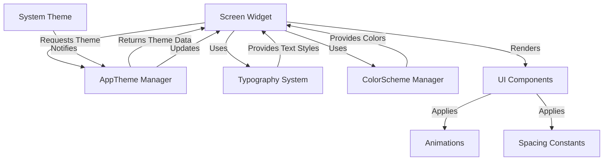

# Design Document: UI Improvements for Marketplace App

## Overview

This design document outlines the comprehensive UI/UX improvements for the Flutter marketplace application. The improvements focus on four main screens (Product Selection, Marketplace Tab, Product Detail, and Add Product Basic Info) while establishing a centralized theming system that ensures consistency, accessibility, and modern visual design across the entire application.

The design emphasizes:
- Modern, dynamic UI components with smooth animations
- Comprehensive dark/light mode support with proper contrast ratios
- Centralized typography and theming system
- Enhanced form UX with auto-focus functionality
- Consistent visual hierarchy and spacing
- Accessibility compliance

## Architecture

### High-Level Architecture

```
┌─────────────────────────────────────────────────────────────┐
│                      Flutter Application                     │
├─────────────────────────────────────────────────────────────┤
│                                                               │
│  ┌────────────────────────────────────────────────────────┐ │
│  │           Centralized Theme System                     │ │
│  │  ┌──────────────┐  ┌──────────────┐  ┌─────────────┐ │ │
│  │  │ AppTheme     │  │ Typography   │  │ ColorScheme │ │ │
│  │  │ Manager      │  │ System       │  │ Manager     │ │ │
│  │  └──────────────┘  └──────────────┘  └─────────────┘ │ │
│  └────────────────────────────────────────────────────────┘ │
│                           │                                   │
│                           ▼                                   │
│  ┌────────────────────────────────────────────────────────┐ │
│  │              UI Component Layer                        │ │
│  │  ┌──────────────┐  ┌──────────────┐  ┌─────────────┐ │ │
│  │  │ Modern Cards │  │ Filter Chips │  │ Form Fields │ │ │
│  │  └──────────────┘  └──────────────┘  └─────────────┘ │ │
│  │  ┌──────────────┐  ┌──────────────┐  ┌─────────────┐ │ │
│  │  │ Buttons      │  │ Animations   │  │ Dialogs     │ │ │
│  │  └──────────────┘  └──────────────┘  └─────────────┘ │ │
│  └────────────────────────────────────────────────────────┘ │
│                           │                                   │
│                           ▼                                   │
│  ┌────────────────────────────────────────────────────────┐ │
│  │                Screen Layer                            │ │
│  │  ┌──────────────────┐  ┌──────────────────────────┐  │ │
│  │  │ Product          │  │ Marketplace Tab          │  │ │
│  │  │ Selection Screen │  │                          │  │ │
│  │  └──────────────────┘  └──────────────────────────┘  │ │
│  │  ┌──────────────────┐  ┌──────────────────────────┐  │ │
│  │  │ Product Detail   │  │ Add Product Basic Info   │  │ │
│  │  │ Screen           │  │ Screen                   │  │ │
│  │  └──────────────────┘  └──────────────────────────┘  │ │
│  └────────────────────────────────────────────────────────┘ │
│                                                               │
└─────────────────────────────────────────────────────────────┘
```

### Component Interaction Flow



## Components and Interfaces

### 1. Centralized Theme System

#### AppTheme Manager

**Location:** `lib/theme/app_theme.dart`

**Purpose:** Centralized theme configuration and management

**Interface:**
```dart
class AppTheme {
  // Theme data for light mode
  static ThemeData lightTheme();
  
  // Theme data for dark mode
  static ThemeData darkTheme();
  
  // Get current theme based on system preference
  static ThemeData getCurrentTheme(BuildContext context);
  
  // Check if current theme is dark
  static bool isDarkMode(BuildContext context);
}
```

**Implementation Details:**
- Extends Flutter's ThemeData
- Defines color schemes for both light and dark modes
- Integrates with Typography System
- Provides helper methods for theme access

#### Typography System

**Location:** `lib/theme/app_typography.dart`

**Purpose:** Centralized font and text style management

**Interface:**
```dart
class AppTypography {
  // Heading styles
  static TextStyle heading1(BuildContext context);
  static TextStyle heading2(BuildContext context);
  static TextStyle heading3(BuildContext context);
  
  // Body text styles
  static TextStyle bodyLarge(BuildContext context);
  static TextStyle bodyMedium(BuildContext context);
  static TextStyle bodySmall(BuildContext context);
  
  // Special styles
  static TextStyle caption(BuildContext context);
  static TextStyle button(BuildContext context);
  static TextStyle label(BuildContext context);
  
  // Font weights
  static const FontWeight light = FontWeight.w300;
  static const FontWeight regular = FontWeight.w400;
  static const FontWeight medium = FontWeight.w500;
  static const FontWeight semibold = FontWeight.w600;
  static const FontWeight bold = FontWeight.w700;
}
```

**Font Hierarchy:**
- Heading 1: 24px, semibold
- Heading 2: 20px, semibold
- Heading 3: 18px, medium
- Body Large: 16px, regular
- Body Medium: 14px, regular
- Body Small: 12px, regular
- Caption: 11px, regular
- Button: 14px, medium
- Label: 13px, medium

#### ColorScheme Manager

**Location:** `lib/theme/app_colors.dart`

**Purpose:** Centralized color definitions and management

**Interface:**
```dart
class AppColors {
  // Primary colors
  static Color primary(BuildContext context);
  static Color primaryDark(BuildContext context);
  static Color primaryLight(BuildContext context);
  
  // Secondary colors
  static Color secondary(BuildContext context);
  static Color accent(BuildContext context);
  
  // Semantic colors
  static Color success(BuildContext context);
  static Color error(BuildContext context);
  static Color warning(BuildContext context);
  static Color info(BuildContext context);
  
  // Background colors
  static Color background(BuildContext context);
  static Color surface(BuildContext context);
  static Color card(BuildContext context);
  
  // Text colors
  static Color textPrimary(BuildContext context);
  static Color textSecondary(BuildContext context);
  static Color textHint(BuildContext context);
  
  // Border colors
  static Color border(BuildContext context);
  static Color divider(BuildContext context);
}
```

**Color Definitions:**

Light Mode:
- Primary: #25D366 (WhatsApp Green)
- Primary Dark: #128C7E
- Secondary: #075E54
- Background: #F5F5F5
- Surface: #FFFFFF
- Card: #FFFFFF
- Text Primary: #000000 (87% opacity)
- Text Secondary: #000000 (60% opacity)
- Text Hint: #000000 (38% opacity)
- Border: #E0E0E0
- Success: #4CAF50
- Error: #F44336
- Warning: #FF9800
- Info: #2196F3

Dark Mode:
- Primary: #25D366
- Primary Dark: #128C7E
- Secondary: #075E54
- Background: #121212
- Surface: #1E1E1E
- Card: #2C2C2C
- Text Primary: #FFFFFF (87% opacity)
- Text Secondary: #FFFFFF (60% opacity)
- Text Hint: #FFFFFF (38% opacity)
- Border: #424242
- Success: #66BB6A
- Error: #EF5350
- Warning: #FFA726
- Info: #42A5F5

### 2. Spacing System

**Location:** `lib/theme/app_spacing.dart`

**Purpose:** Consistent spacing values across the application

**Interface:**
```dart
class AppSpacing {
  static const double xs = 4.0;
  static const double sm = 8.0;
  static const double md = 12.0;
  static const double lg = 16.0;
  static const double xl = 24.0;
  static const double xxl = 32.0;
  
  // Padding helpers
  static EdgeInsets paddingAll(double value);
  static EdgeInsets paddingHorizontal(double value);
  static EdgeInsets paddingVertical(double value);
  
  // Margin helpers
  static EdgeInsets marginAll(double value);
  static EdgeInsets marginHorizontal(double value);
  static EdgeInsets marginVertical(double value);
}
```

### 3. Modern UI Components

#### ModernCard Widget

**Purpose:** Reusable card component with consistent styling

**Interface:**
```dart
class ModernCard extends StatelessWidget {
  final Widget child;
  final EdgeInsets? padding;
  final double? elevation;
  final Color? backgroundColor;
  final BorderRadius? borderRadius;
  
  const ModernCard({
    required this.child,
    this.padding,
    this.elevation,
    this.backgroundColor,
    this.borderRadius,
  });
}
```

**Styling:**
- Border radius: 12-16px
- Elevation: 2-4 (light mode), 4-8 (dark mode)
- Background: Card color from theme
- Padding: 16px default

#### FilterChip Widget

**Purpose:** Modern chip-style filter button

**Interface:**
```dart
class FilterChip extends StatelessWidget {
  final String label;
  final bool isSelected;
  final VoidCallback onTap;
  final IconData? icon;
  
  const FilterChip({
    required this.label,
    required this.isSelected,
    required this.onTap,
    this.icon,
  });
}
```

**Styling:**
- Border radius: 20px (pill shape)
- Height: 36px
- Padding: 12px horizontal
- Selected: Primary color background, white text
- Unselected: Border with primary color, primary color text
- Animation: 200ms color transition

#### GradientButton Widget

**Purpose:** Action button with gradient background

**Interface:**
```dart
class GradientButton extends StatelessWidget {
  final String text;
  final VoidCallback onPressed;
  final List<Color>? gradientColors;
  final double? height;
  final double? width;
  final bool isLoading;
  
  const GradientButton({
    required this.text,
    required this.onPressed,
    this.gradientColors,
    this.height,
    this.width,
    this.isLoading = false,
  });
}
```

**Styling:**
- Default gradient: [#25D366, #128C7E]
- Border radius: 8-12px
- Height: 48px default
- Text: Button text style from typography
- Loading state: Shows circular progress indicator

#### AutoFocusTextField Widget

**Purpose:** Text field with auto-focus capability

**Interface:**
```dart
class AutoFocusTextField extends StatefulWidget {
  final TextEditingController controller;
  final String label;
  final String? hint;
  final TextInputType? keyboardType;
  final FocusNode? focusNode;
  final FocusNode? nextFocusNode;
  final bool isLastField;
  final Function(String)? onFieldComplete;
  final String? Function(String?)? validator;
  
  const AutoFocusTextField({
    required this.controller,
    required this.label,
    this.hint,
    this.keyboardType,
    this.focusNode,
    this.nextFocusNode,
    this.isLastField = false,
    this.onFieldComplete,
    this.validator,
  });
}
```

**Behavior:**
- Validates input on change
- Auto-focuses next field when validation passes
- Provides visual focus indicator
- Supports custom validation logic

### 4. Screen-Specific Components

#### Product Selection Screen

**Enhanced Components:**

1. **ImageCarousel**
   - Horizontal scrollable image list
   - 2.5 images visible at once
   - Smooth page transitions
   - Image counter badge
   - Delete button on each image

2. **VariantSelector**
   - Dropdown/modal for variant selection
   - Color-coded options
   - Smooth expand/collapse animation
   - Visual feedback on selection

3. **DuplicateWarning**
   - High-contrast warning message
   - Icon with semantic color (warning orange)
   - Visible in both light and dark modes
   - Dismissible with animation

**Layout Structure:**
```
┌─────────────────────────────────────┐
│         App Bar (Dark)              │
├─────────────────────────────────────┤
│                                     │
│   ┌─────────────────────────────┐  │
│   │   Image Carousel            │  │
│   │   (2.5 images visible)      │  │
│   └─────────────────────────────┘  │
│                                     │
│   ┌─────────────────────────────┐  │
│   │   Variant Type Section      │  │
│   │   ┌───────┐  ┌───────┐     │  │
│   │   │ Color │  │ Size  │     │  │
│   │   └───────┘  └───────┘     │  │
│   └─────────────────────────────┘  │
│                                     │
│   ┌─────────────────────────────┐  │
│   │   Duplicate Warning         │  │
│   │   ⚠️ Duplicates not accepted│  │
│   └─────────────────────────────┘  │
│                                     │
│   ┌─────────────────────────────┐  │
│   │   Color Variants List       │  │
│   │   [Red] [Blue] [Green]      │  │
│   └─────────────────────────────┘  │
│                                     │
│   [Continue Button - Gradient]     │
└─────────────────────────────────────┘
```

#### Marketplace Tab

**Enhanced Components:**

1. **SearchBar**
   - Rounded corners (8px)
   - Icon prefix (search)
   - Voice and camera icons
   - Smooth focus animation

2. **FilterBar**
   - Horizontal scrollable
   - Filter chips for: Sort, Category, Gender, Location
   - Active state indication
   - Smooth scroll behavior

3. **CategoryIcons**
   - Circular icon buttons
   - Color-coded categories
   - Selection animation
   - Label below icon

4. **ProductGrid**
   - 2-column grid
   - Modern card design
   - Image with overlay info
   - Price and discount badges

**Layout Structure:**
```
┌─────────────────────────────────────┐
│   Greeting & Search Bar             │
├─────────────────────────────────────┤
│   [Sort] [Category] [Gender] [...]  │
├─────────────────────────────────────┤
│   Delivery Location Banner          │
├─────────────────────────────────────┤
│   Category Icons (Horizontal)       │
│   ○ ○ ○ ○ ○                        │
├─────────────────────────────────────┤
│   Sale Banner                       │
├─────────────────────────────────────┤
│   Product Grid                      │
│   ┌──────┐  ┌──────┐               │
│   │ Prod │  │ Prod │               │
│   │  1   │  │  2   │               │
│   └──────┘  └──────┘               │
│   ┌──────┐  ┌──────┐               │
│   │ Prod │  │ Prod │               │
│   │  3   │  │  4   │               │
│   └──────┘  └──────┘               │
└─────────────────────────────────────┘
```

#### Product Detail Screen

**Enhanced Components:**

1. **ImageGallery**
   - Full-width image viewer
   - Swipe navigation
   - Zoom capability
   - Image counter
   - Grid view toggle

2. **ProductInfo**
   - Card-based sections
   - Clear typography hierarchy
   - Collapsible sections
   - Price tiers display

3. **ColorSwatches**
   - Horizontal scrollable
   - Image-based swatches
   - Selection indicator
   - Smooth transition on change

4. **SizeSelector**
   - Modal bottom sheet
   - Grid layout for sizes
   - Stock availability indicator
   - Quantity selector

**Layout Structure:**
```
┌─────────────────────────────────────┐
│   App Bar with Search               │
├─────────────────────────────────────┤
│                                     │
│   ┌─────────────────────────────┐  │
│   │   Image Gallery             │  │
│   │   (Swipeable, Zoomable)     │  │
│   └─────────────────────────────┘  │
│                                     │
│   Product Name                      │
│                                     │
│   ┌─────────────────────────────┐  │
│   │   Color Swatches            │  │
│   │   [●] [●] [●] [●]           │  │
│   └─────────────────────────────┘  │
│                                     │
│   ┌─────────────────────────────┐  │
│   │   Pricing Section           │  │
│   │   ₹999 (MOQ: 10 pcs)        │  │
│   └─────────────────────────────┘  │
│                                     │
│   ┌─────────────────────────────┐  │
│   │   Size Selection            │  │
│   │   [S] [M] [L] [XL]          │  │
│   └─────────────────────────────┘  │
│                                     │
│   [Add to Cart] [Buy Now]          │
└─────────────────────────────────────┘
```

#### Add Product Basic Info Screen

**Enhanced Components:**

1. **AutoFocusForm**
   - Vertical field layout
   - Auto-focus on completion
   - Visual focus indicators
   - Validation feedback

2. **CategorySelector**
   - Modal with search
   - Recently selected section
   - Hierarchical categories
   - Quick selection chips

3. **PriceSlabManager**
   - Add/remove price tiers
   - MOQ input
   - Visual tier list
   - Validation

4. **AttributeManager**
   - Expandable sections
   - Custom attribute addition
   - Predefined options
   - Multi-select support

**Layout Structure:**
```
┌─────────────────────────────────────┐
│   App Bar                           │
├─────────────────────────────────────┤
│                                     │
│   Product Name                      │
│   [________________]                │
│                                     │
│   Category                          │
│   [Select Category ▼]               │
│                                     │
│   Available Quantity                │
│   [________________]                │
│                                     │
│   Price Slabs                       │
│   ┌─────────────────────────────┐  │
│   │ ₹999 - MOQ: 10 pcs     [×] │  │
│   └─────────────────────────────┘  │
│   [+ Add Price Slab]                │
│                                     │
│   Sizes                             │
│   [S] [M] [L] [XL] [XXL]           │
│                                     │
│   Attributes                        │
│   ▼ Fabric                          │
│   ▼ Fit                             │
│                                     │
│   Description                       │
│   [________________]                │
│   [________________]                │
│                                     │
│   [Save Product - Gradient]         │
└─────────────────────────────────────┘
```

## Data Models

### Theme Configuration Model

```dart
class ThemeConfig {
  final ColorScheme colorScheme;
  final TextTheme textTheme;
  final bool isDark;
  
  ThemeConfig({
    required this.colorScheme,
    required this.textTheme,
    required this.isDark,
  });
}
```

### Typography Configuration Model

```dart
class TypographyConfig {
  final Map<String, TextStyle> styles;
  final Map<String, FontWeight> weights;
  final Map<String, double> sizes;
  
  TypographyConfig({
    required this.styles,
    required this.weights,
    required this.sizes,
  });
}
```

### Spacing Configuration Model

```dart
class SpacingConfig {
  final Map<String, double> values;
  
  SpacingConfig({required this.values});
  
  double get xs => values['xs']!;
  double get sm => values['sm']!;
  double get md => values['md']!;
  double get lg => values['lg']!;
  double get xl => values['xl']!;
  double get xxl => values['xxl']!;
}
```

## Correctness Properties

*A property is a characteristic or behavior that should hold true across all valid executions of a system—essentially, a formal statement about what the system should do. Properties serve as the bridge between human-readable specifications and machine-verifiable correctness guarantees.*

### Property 1: Contrast Ratio Compliance

*For any* text element and its background in both light and dark modes, the contrast ratio should meet or exceed 4.5:1 for normal text and 3:1 for large text (18px+ or 14px+ bold).

**Validates: Requirements 1.1, 5.2, 5.3, 5.6**

### Property 2: Visual Feedback on Interaction

*For any* interactive element (button, filter, variant selector), when a user interacts with it, the system should trigger a visual state change (color, elevation, or animation).

**Validates: Requirements 1.4, 2.3**

### Property 3: Consistent Spacing

*For any* UI element with padding or margin, the spacing value should match one of the predefined constants (4, 8, 12, 16, 24, 32 pixels).

**Validates: Requirements 1.5, 7.1, 7.4**

### Property 4: Auto-Focus Behavior

*For any* form field that is not the last field, when input is completed and validation passes, focus should automatically move to the next field.

**Validates: Requirements 4.2, 4.5**

### Property 5: Focus Visual Indicator

*For any* form field, when it has focus, it should have visually distinct styling (border color, background, or shadow) compared to unfocused state.

**Validates: Requirements 4.3**

### Property 6: Theme Responsiveness

*For any* UI element, when the system theme changes between light and dark mode, the element's colors should update to match the new theme without requiring app restart.

**Validates: Requirements 5.1, 5.5**

### Property 7: Interactive Element Visibility

*For any* interactive element in both light and dark modes, the element should have sufficient contrast with its background to be clearly visible and distinguishable.

**Validates: Requirements 5.4**

### Property 8: Typography Hierarchy

*For any* pair of text elements where one is primary and one is secondary, the primary element should have a larger font size or heavier font weight than the secondary element.

**Validates: Requirements 3.3, 7.2**

### Property 9: Scroll Animation Smoothness

*For any* scrollable view, when scrolling occurs, the animation duration should be between 200-300 milliseconds.

**Validates: Requirements 3.5**

### Property 10: Theme-Based Style Retrieval

*For any* text style request from the Typography System, the returned style should reflect the current theme (light or dark) with appropriate colors.

**Validates: Requirements 6.3, 6.6**

### Property 11: Font Size Hierarchy

*For any* text hierarchy level (heading, body, caption), each level should have a distinct font size that differs from adjacent levels by at least 2 pixels.

**Validates: Requirements 6.5**

### Property 12: Border Radius Consistency

*For any* card, button, or input field, the border radius should be between 8 and 16 pixels.

**Validates: Requirements 8.1**

### Property 13: Haptic and Visual Feedback

*For any* button tap, the system should trigger both haptic feedback and a visual ripple effect.

**Validates: Requirements 8.2**

### Property 14: Animation Duration Compliance

*For any* state transition animation, the duration should be between 200 and 300 milliseconds.

**Validates: Requirements 8.3**

### Property 15: Loading State Display

*For any* loading state, the UI should display either a skeleton screen or shimmer effect widget.

**Validates: Requirements 8.5**

### Property 16: Color Usage Consistency

*For any* UI element type (main action, supporting action, status indicator), all instances of that type should use the same color from the theme (primary, secondary, or semantic color).

**Validates: Requirements 9.2, 9.3, 9.4, 9.5**

### Property 17: Minimum Font Size

*For any* text element, the font size should be at least 12 pixels for body text and at least 14 pixels for interactive element labels.

**Validates: Requirements 10.1**

### Property 18: Touch Target Size

*For any* interactive element, the touch target size should be at least 44x44 pixels.

**Validates: Requirements 10.2**

### Property 19: Font Scaling Support

*For any* text element, when the system font size is increased, the text should scale proportionally while maintaining readability.

**Validates: Requirements 10.3**

### Property 20: Input Field Labels

*For any* input field, it should have either a non-empty label or a non-empty hint text.

**Validates: Requirements 10.4**

### Property 21: Interaction Feedback

*For any* user interaction (tap, swipe, long-press), the system should provide visual feedback through state changes, animations, or color transitions.

**Validates: Requirements 10.5**

## Error Handling

### Theme Loading Errors

**Scenario:** Theme configuration fails to load or is corrupted

**Handling:**
- Fall back to default Flutter theme
- Log error for debugging
- Display user-friendly message if theme is critical
- Attempt to reload theme on next app start

### Font Loading Errors

**Scenario:** Custom fonts fail to load

**Handling:**
- Fall back to system default fonts
- Log error for debugging
- Continue with default typography
- Maintain font size and weight hierarchy

### Color Contrast Violations

**Scenario:** Calculated contrast ratio is below minimum threshold

**Handling:**
- Log warning with specific color combination
- Automatically adjust text color to meet minimum contrast
- Provide developer tools to identify violations
- Use fallback high-contrast colors

### Auto-Focus Failures

**Scenario:** Next field cannot receive focus or doesn't exist

**Handling:**
- Gracefully skip to next available field
- If no next field, keep focus on current field
- Log warning for debugging
- Ensure keyboard remains visible

### Animation Performance Issues

**Scenario:** Animations cause frame drops or lag

**Handling:**
- Reduce animation complexity
- Disable animations on low-end devices
- Provide settings to disable animations
- Use simpler transitions as fallback

## Testing Strategy

### Dual Testing Approach

This feature requires both unit testing and property-based testing for comprehensive coverage:

**Unit Tests:** Focus on specific examples, edge cases, and integration points
- Test specific color combinations for contrast
- Test individual component rendering
- Test theme switching behavior
- Test auto-focus with specific field configurations
- Test animation triggers and completions

**Property Tests:** Verify universal properties across all inputs
- Test contrast ratios across all color combinations
- Test spacing consistency across all widgets
- Test auto-focus behavior with various form configurations
- Test theme responsiveness with random theme switches
- Test font scaling with various system settings

### Property-Based Testing Configuration

**Library:** Use `flutter_test` with custom property test helpers or integrate `test` package with property testing utilities

**Configuration:**
- Minimum 100 iterations per property test
- Each test references its design document property
- Tag format: **Feature: ui-improvements-marketplace, Property {number}: {property_text}**

**Example Property Test Structure:**
```dart
// Feature: ui-improvements-marketplace, Property 1: Contrast Ratio Compliance
test('contrast ratios meet WCAG standards', () {
  for (int i = 0; i < 100; i++) {
    final textColor = generateRandomColor();
    final backgroundColor = generateRandomColor();
    final fontSize = generateRandomFontSize();
    
    final ratio = calculateContrastRatio(textColor, backgroundColor);
    final minRatio = fontSize >= 18 ? 3.0 : 4.5;
    
    expect(ratio, greaterThanOrEqualTo(minRatio));
  }
});
```

### Unit Test Coverage

**Theme System Tests:**
- Test light theme color definitions
- Test dark theme color definitions
- Test theme switching
- Test typography style retrieval
- Test spacing constant values

**Component Tests:**
- Test ModernCard rendering
- Test FilterChip selection state
- Test GradientButton press handling
- Test AutoFocusTextField focus management
- Test ImageCarousel swipe behavior

**Screen Tests:**
- Test Product Selection Screen layout
- Test Marketplace Tab filter application
- Test Product Detail Screen image gallery
- Test Add Product Form validation

**Integration Tests:**
- Test theme changes across multiple screens
- Test auto-focus flow through entire form
- Test filter selection and product grid update
- Test color swatch selection and image update

### Accessibility Testing

- Test with screen readers
- Test with increased font sizes
- Test with high contrast mode
- Test touch target sizes
- Test keyboard navigation

### Visual Regression Testing

- Capture screenshots of all screens in light mode
- Capture screenshots of all screens in dark mode
- Compare against baseline images
- Flag any unexpected visual changes

### Performance Testing

- Measure animation frame rates
- Test scroll performance with large product lists
- Test theme switching performance
- Test image loading and caching
- Ensure 60fps for all animations
